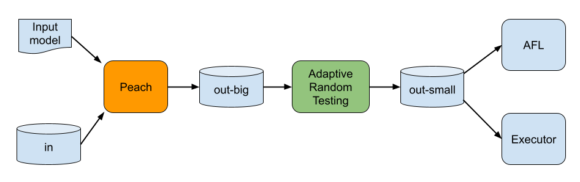
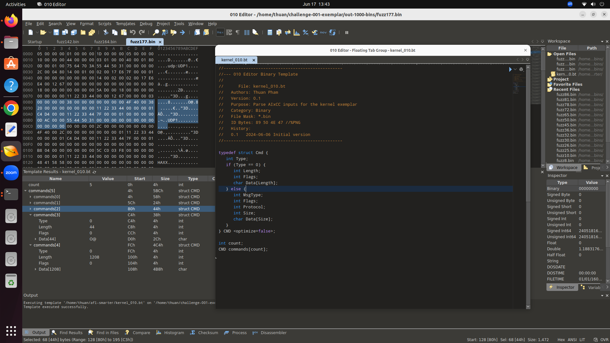

# Fuzzing Linux Kernel & Nginx exemplars with Peach

## Overview

Following is the workflow to fuzz the exemplars with Peach. We implement Adaptive Random Testing (ART) to select tests instead of running all the tests. This feature is very helpful, especially for slow targets like the Linux kernel.

Peach takes an input model (also known as a Peach pit) and a corpus of sample inputs (optional) to perform structure-aware generation-based and mutation-based fuzzing. The ART-based test selection is called in batches, for example, after Peach generates every 50 tests. We can run all tests selected by ART and/or put them in a shared folder so that fuzzers like libAFL can pick them up.



## Detailed fuzzing instructions

1. Build a Docker image (as Peach does not work directly on Ubuntu 22.04)
```
docker build . -t peach-aixcc
```
2. Run the docker container and mount a folder to store test cases generated by fuzzing

In the Peach pits (e.g., kernel_pit.xml), it tells Peach by default to get sample inputs from the /home/ubuntu/shared/in folder inside the Docker container. Therefore, make sure to place the same corpus folder into our shared folder on the host. For instance, for the Linux kernel exemplar, we can use the sample seeds stored inside the corpus-kernel folder by running the following commands.

```
mkdir -p <shared-folder-on-host>/in
cp corpus-kernel/*.bin <shared-folder-on-host>/in
```

And now we can start the Docker container

```
docker run -v <shared-folder-on-host>:/home/ubuntu/shared -it peach-aixcc /bin/bash
```
3. Run Peach with the suitable peach pit inside the docker

Before running Peach, we can set (exemplar-specific) parameters by setting corresponding environment variables

```
export AIxCC_BATCH_SIZE=10 #It means ART algorith runs after every 10 tests generated by Peach
export AIxCC_INDEX_FILE=/tmp/INDEX_FILE #This file just keeps the current test index, starting at 0
export AIxCC_TMP_DIR=/tmp/tmp_dir #This folder keeps tests generated by Peach, before being processed by ART
export AIxCC_OUT_DIR=/home/ubuntu/shared/out-kernel #This keeps all tests selected by ART
echo 0 > $AIxCC_INDEX_FILE #Reset the test index if necessary
```

And it is ready to run Peach now. The following command asks Peach to generate 1,000 tests in total, but ART will produce only 105 tests, including 5 initial tests selected randomly by ART and 100 more tests selected later (one for each batch of 10 tests).

```
peach --range 1,1000 kernel_pit.xml
```
4. On the kernel challenge folder, run the generated test cases with the kernel binary
```
for f in $(echo <path to out-kernel>/id*); do echo "Checking $f"; ./run.sh run_pov $f linux_test_harness | grep -i 'pov\|trigger'; done > log.txt 2>&1
```
5. Analyze the results
Analyze the log.txt log file and see which test cases triggered the crash.

## Fuzzing with context free grammars (e.g., http.g4)

Run Grammarinator with ART support (wrapped inside the cfg_fuzzing script) with the suitable ANTLR grammar file (e.g., http.g4) inside the docker

Before running cfg_fuzzing, we can update (exemplar-specific) parameters by setting corresponding environment variables

```
export AIxCC_BATCH_SIZE=50 #It means ART algorith runs after every 10 tests generated by Grammarinator
export AIxCC_TMP_DIR=/tmp/tmp_dir #This folder keeps tests generated by Grammarinator, before being processed by ART
export AIxCC_OUT_DIR=/home/ubuntu/shared/out-kernel #This keeps all tests selected by ART
export AIxCC_MAX_COUNT=1000 #We ask Grammarinator to generate 1000 test cases in total
export AIxCC_MAX_DEPTH=40 #We set the maximum recursion depth during Grammarinator's test generation
```

And it is ready to run cfg_fuzzing now. With the above settings, the following command asks Grammarinator to generate 1,000 tests in total, but ART will produce only 25 tests, including 5 initial tests selected randomly by ART and 1000 more tests selected later (one for each batch of 50 tests).

```
cfg_fuzzing http.g4
OR
cfg_fuzzing HTMLParser.g4 HTMLLexer.g4 # in case two g4 files for one grammar, order does not matter
```

## Analyzing binary files with 010Editor
Download [010Editor](https://www.sweetscape.com/010editor/). Open the binary file you want to analyze and then open the kernel_010.bt as the binary template. Then run this template to see the structure of the binary file. Following is a sample screenshot.



## Detailed instructions for checking validity of a given input

This maybe helpful for Ruijie to work on input model inferencing

1. Build a Docker image
```
docker build . -f Dockerfile-cracker -t peach-cracker
```
2. Run the docker container
mount a folder to keep sample tests/binaries
```
docker run -v <shared-folder-on-host>:/home/ubuntu/shared -it peach-cracker /bin/bash
```
3. Run a modified version of Peach to crack a given input file
```
peach -1 -inputFilePath=<input-file-name> -outputFilePath=dummy kernel_pit_cracker.xml
```
if the output is ok, it means that the given input file is fully crackable (its validity is 100%)
